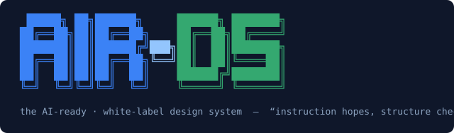

<p align="center">
  
</p>
# AIR-DS — an AI-ready, white-label design system

One neutral, token-driven design system, engineered for re-branding, that ships with the complete machine layer AI agents need to build with it correctly: MCP server, llms.txt, agent skills, editor rules, and closed-world registries — all **compiled from one source of truth** and re-emitted per customer.

> **The principle:** *"Instruction hopes the model complies. Structure checks."*
> Every legal token and component is enumerated in generated registries. Anything not in a registry is provably fabricated — and unmergeable, not merely "flagged."

- 📋 **Overview deck:** [docs/AIR-DS-overview.pptx](docs/AIR-DS-overview.pptx)
- 🏗 **Architecture:** [docs/architecture.md](docs/architecture.md) · **The record (brief → mandate, dated):** [docs/EVOLUTION.md](docs/EVOLUTION.md) · **Decisions:** [docs/decisions/](docs/decisions/)

## What's here, measured

| | |
|---|---|
| **Tokens** | 232 public tokens (DTCG source, three tiers); brand tier is the *only* theming surface; WCAG-AA contrast gate **fails the build** (27 audited pairs + alias index) |
| **Components** | 14 components + 25 icons on react-aria-components; typed literal-union props; a11y built in; 97 Storybook stories swept by axe in real Chromium — **0 violations** |
| **Machine surface** | llms.txt family, markdown twins, 6 agent skills (incl. `design-to-code`), 4 editor channels (Cursor/Copilot/Claude Code/v0), a 6-tool MCP server, extension-points contract, per-customer auditor agent — all generated, never hand-written |
| **Enforcement** | One deterministic gauntlet (`pnpm validate`), 11+ custom rules, 21 eval pairs at 1.0 on critical gates, fixture-replay benchmark, per-release metrics — **no LLM in the merge path** |
| **White-label** | Customer = one brand token file. The `acme` sample goes from intake file to a fully branded system — every AI artifact included — in ~260 ms |
| **Tests** | 1,013 across eleven packages (measured, not estimated) |

## The control plane (Mandate v2)

The design system above is the proof; these are the product — the governance layer for AI-generated UI at enterprise scale ([docs/strategy/mandate-v2.md](docs/strategy/mandate-v2.md)). All credential-free, all deterministic:

| Capability | Command | What it proves |
|---|---|---|
| **Assess any repo's AI-readiness** | `pnpm --filter @ds/assess exec ds-assess <repo>` | Six evidence-backed pillars, graded. This repo: 99.4/A; a typical 2023 DS fixture: 6.6/F with the gaps named |
| **Retrofit an existing design system** | `pnpm --filter @ds/retrofit exec ds-retrofit <repo> -o <out>` | Their CSS vars/Tailwind/React lib in → registries, compiled machine surface, and a fabrication-blocking gauntlet on top of *their* components ([proof fixture](examples/legacy-ds-retrofit/)) |
| **Govern a fleet of repos** | `ds-fleet collect … && ds-fleet render` | Hallucination rate, first-pass gauntlet rate, eval/a11y/policy compliance across N repos in one executive dashboard; policy-as-code breaches exit nonzero |
| **Safe generative UI at runtime** | `@ds/genui` — schema + validator + renderer | Agents emit a wire format that can *only* compose registry components; host-bound intents, never code. 51-case fuzz: every injection rejected or inert |
| **Beyond React** | tokens `dist/wc/`, `dist/react-native/`, [`@ds/wc`](packages/wc/) | Same token graph, new render targets; `<ds-button>` with its own closed-world registry ([demo](examples/wc-demo/)) |
| **Auditor-ready evidence** | `pnpm --filter @ds/validate run evidence` | WCAG + provenance + dependency bundle with freshly executed gate results |

## Getting started

Prereqs: Node ≥ 24, pnpm 9.

```bash
pnpm install
pnpm build        # tokens → components → registries → context artifacts → MCP
pnpm storybook    # browse all 14 components + stories at localhost:6006
```

**Designers / first look — the 30-second version:**

```bash
bash scripts/demo.sh
```

One command, fully offline, zero credentials: build → validation gauntlet → evals → benchmark → ingest the sample customer → metrics scoreboard.

**The white-label money shot** (same compiled screen, two brands, side by side):

```bash
node examples/brand-demo/build.mjs
open examples/brand-demo/dist/index.html
```

**Agent-native exploration:** open this repo in Claude Code — [.mcp.json](.mcp.json) auto-wires the `ds-mcp` server, so you can ask it to `get_component`, `list_tokens`, or `validate_usage` against the live registries. The compiled agent-facing docs live in `packages/context/dist/default/` (llms.txt, skills, editor rules).

## Repo map

```
packages/tokens     @ds/tokens    DTCG token source + build (CSS vars, TS types, registries, AA gate)
packages/react      @ds/react     components + icons + stories + tests; generate.ts compiles the registry
packages/context    @ds/context   compiler for ALL agent-facing artifacts, per brand
packages/mcp        @ds/mcp       ds-mcp server (search_docs, get_component, list_tokens, validate_usage, …)
tooling/validate    @ds/validate  the gauntlet CLI + custom rules + evals + benchmark + stories-axe
tooling/ingest      @ds/ingest    brand intake → OKLCH ramps → AA auto-repair → full customer bundle
brands/             brand-tier token files (default.json = neutral core; acme = sample customer)
registries/         GENERATED closed-world contracts — the machine source of truth
customer-builds/    per-customer output bundles (see acme/)
examples/           reference screen (agent-built), brand demo
docs/               brief, ADRs, architecture, specs, patterns, the overview deck
evals/ · metrics/   rule regression pairs · per-release measurement history
```

## How theming works (the whole model)

1. A customer engagement produces **one brand file** (`brands/<name>.json`) — palette seeds, typefaces, scale scalars. Optional allowlisted semantic overrides. Zero component changes.
2. `ds-ingest run <intake.json>` validates, generates ramps deterministically, **pre-checks WCAG-AA and auto-repairs** failures (logged, never shipped), rebuilds tokens in isolation, and re-emits every AI artifact with the customer's values into `customer-builds/<name>/`.
3. Their agents consume **their** system: llms.txt, skills, editor rules, and MCP answers all reflect the active brand.

## Quality gates you can run right now

```bash
pnpm validate                                  # typecheck → lint (11 rules) → build → test+axe → registry check
pnpm --filter @ds/validate run evals           # 21 wrong→right pairs; critical gates require 1.0
pnpm --filter @ds/validate run stories-axe     # browser axe over all 97 stories (needs: npx playwright install chromium)
pnpm --filter @ds/validate run benchmark       # scored scoreboard vs raw-Tailwind baseline, offline fixture replay
```

The negative-rule catalog ([docs/specs/negative-rules.md](docs/specs/negative-rules.md), NR-001…013) is living documentation of observed agent hallucination classes — each one compiles into the shipped skills/editor rules **and** has a deterministic check plus an eval pair.

## Publishing & distribution (deliberately not on npm)

Nothing here requires credentials to build, validate, or demo — that's a recorded project rule. Distribution is **gated by design**: per-customer private npm scopes are part of a client engagement, not this repo.

```bash
bash scripts/release-pack.sh        # proves releasability locally: *.tgz per package + version-stamped registry bundle
node scripts/release-version.mjs    # version bump + changelog
```

Actual `npm publish` is a documented, **disabled** step in [.github/workflows/release.yml](.github/workflows/release.yml), gated on a client-provided `NPM_TOKEN`.

## Status & roadmap

All five phases of the [brief](docs/brief.md) are complete and gated (decision records in [docs/decisions/](docs/decisions/)). Honest edges, tracked in [docs/specs/feedback-backlog.md](docs/specs/feedback-backlog.md): the Figma library + Code Connect (the token pipeline is variables-ready; the `design-to-code` skill ships the Figma-agnostic half), pilot customers, and a scoped v1.1 backlog (FB-1…14).

## Contributing a component

Read [packages/react/CONTRIBUTING-COMPONENT.md](packages/react/CONTRIBUTING-COMPONENT.md) — it's the exact checklist an outside agent used to build a gauntlet-green component on the first try. `pnpm generate` rebuilds the barrel and registries; never edit generated files by hand. Team conventions: [CLAUDE.md](CLAUDE.md).
