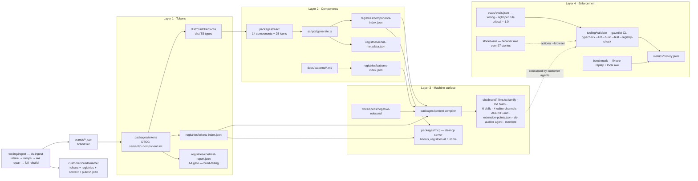

# AIR-DS architecture — four layers, one source of truth

How the repo implements the brief. Every arrow below is a deterministic build step; nothing agent-facing is hand-written (ADR-004). For decisions, see `docs/decisions/`; for the live state, run `bash scripts/demo.sh`.

## The layers in one paragraph each

**L1 Tokens** (`packages/tokens`, ADR-003). DTCG JSON in three tiers; the brand tier (`brands/*.json`) is the only theming surface. The build derives ramps/scales, emits CSS custom properties + literal-union TS types, and enumerates every public token in `tokens-index.json` — the closed world. WCAG-AA contrast on 27 mandated pairs fails the build; `aliasIndex` extends the audit down to component hooks.

**L2 Components** (`packages/react`, ADR-002). React 19 + react-aria-components; discriminated-union props; token-only CSS Modules (allowed literals are pinned by the shared validator ruleset); a11y inside. `generate.ts` compiles the barrel and `components-index.json` (exact prop literal text, `racProps`, `tokenPrefix`, `storyFile`, `@example`). Stories are contract artifacts — 97 of them, axe-swept in a real browser. The contribution canon lives in `CONTRIBUTING-COMPONENT.md` and was acceptance-tested by an agent building a 15th component from it alone.

**L3 Machine surface** (`packages/context` + `packages/mcp`, ADR-004). The context compiler deterministically emits everything an agent consumes — llms.txt family (token-budget gated), markdown twins, six skills (incl. `design-to-code` spec extraction), four editor channels from one rule source, `extension-points.json`, and a compiled per-customer `ds-auditor` — with a sha256 manifest; build-twice is byte-identical. `ds-mcp` serves search/get/list/validate/audit/theming tools from the registries at runtime, per brand.

**L4 Enforcement** (`tooling/validate` + `evals/`, ADR-005). One gauntlet, no LLM in the merge path. Custom deterministic rules (closed-world token/component checks, CSS literal discipline, property↔category conformance, dead-hook, cross-hook borrowing, generator drift vs HEAD, state-selector canon, dead module classes, reduced-motion, TSX inline-style literals). Every negative rule has a wrong→right eval pair; critical pairs gate at 1.0. Metrics append to `metrics/history.jsonl` per run.

**White-label ops** (`tooling/ingest`, ADR-006). `ds-ingest run <intake.json>`: validate intake → generate OKLCH ramps from seeds → pre-check and auto-repair AA → isolated tokens build → per-brand context artifacts → self-sufficient `customer-builds/<name>/` bundle with publish plan. The acme demo runs in ~260ms. `examples/brand-demo` renders the same compiled screen under two brands side by side.

## The improvement loop

Auditor/acceptance finding → wrong→right pair in `docs/specs/negative-rules.md` → compiled into skills/editor rules/MCP messages → promoted to a deterministic gauntlet rule + eval pair when the shape allows. NR-001…013 all took this path; `docs/specs/feedback-backlog.md` holds the queue.

## Credential-free rule

Everything above builds, validates, and demos offline (`scripts/demo.sh`). The pluggable client-credential points: benchmark `--generator`, npm publish (`NPM_TOKEN`-gated, disabled), Figma adapter in the `design-to-code` skill.
